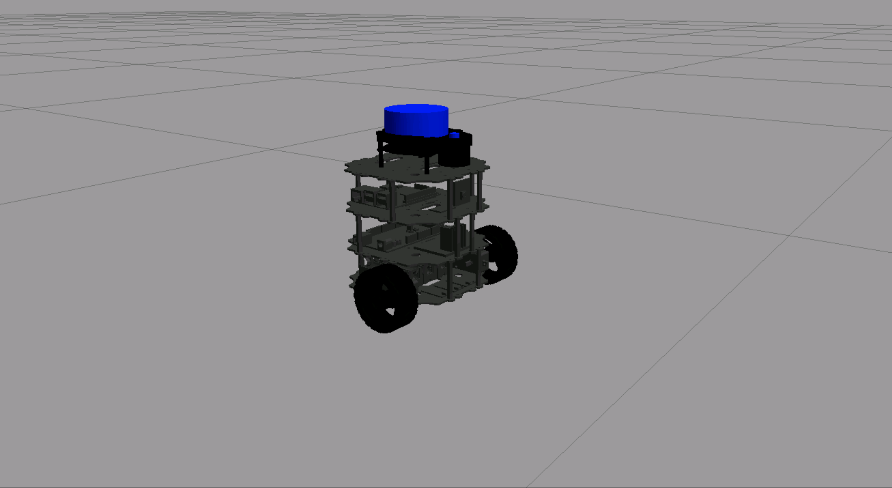

# Move Tortoisebot

This repository contains `ROS2` package which is created to test and evaluate the movement of a `TortoiseBot` by controlling and monitoring its position and orientation through publishing velocity commands and subscribing to odometry data.


  

## Structure

```text
.
├── launch
│   └── move_tortoisebot.launch.py
├── src
│   └── move_tortoisebot.cpp
├── CMakeLists.txt
├── README.md
└── package.xml
```

## Setup

#### Distribution

Use docker for quick-start (for both ROS1 or ROS2):

```bash
# using docker for ROS1
$ docker run -ti --rm --name local-ros-noetic ros:noetic
```

```bash
# using docker for ROS2
$ docker run -ti --rm --name local-ros-humble ros:humble
```

#### Build (Package)

Now, create a ros2 workspace, clone the package:

```bash
# setup directory
$ mkdir ~/ros2_ws/src/
$ git clone <repo_name> ~/ros2_ws/src/
```

Install the required packages (dependency) mentioned in `package.xml` using `apt`:

```bash
# check if package is available
$ ros2 pkg list
$ ros2 node list
```

```bash
# update path to installed packages
$ source /opt/ros/humble/setup.bash
```

To build locally or inside docker use the following commands:

```bash
# execute build
$ cd ~/ros2_ws && colcon build
$ source ~/ros2_ws/install/setup.bash
```

## Robot

`TortoiseBot` is an extremely learner friendly and cost efficient `ROS` based open sourced mobile robot that is capable of doing tele-operation, manual as well as autonomous mapping and navigation.



**Note:** Check more details about `TortoiseBot` from [here](https://github.com/rigbetellabs/tortoisebot).

## Launch

Connect the robot via ssh to establish ros communication from rosject (no port mapping needed as using host network).

```bash
# terminal 1 (rosject)
$ ssh tortoisebot@master
```

```bash
# terminal 2 (rosject)
$ ros2 launch move_tortoisebot move_tortoisebot.launch.py
```


## Roadmap

- [x] Part 1 : Assemble the robot from all the shipped parts.

- [x] Part 2 : Write node to test and control robot.

See the [open issues](https://github.com/llabhishekll/tortoisebot_move/issues) for a full list of proposed features (and known issues).

## Tools

System tool/modules used for project development.

- `Applications` : [vs-code](https://code.visualstudio.com/), [ros-extensions](https://marketplace.visualstudio.com/items?itemName=ms-iot.vscode-ros) and [docker-desktop](https://docs.docker.com/get-docker/).
- `ROS` : [ros-docker-images](https://hub.docker.com/_/ros/) (`humble`, `noetic`) or [build-source](https://www.ros.org/blog/getting-started/).

## License

Distributed under the MIT License. See `LICENSE.txt` for more information.
